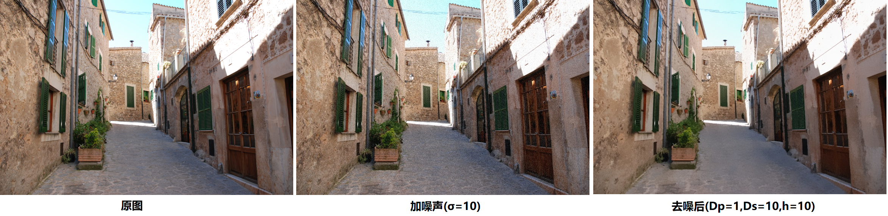
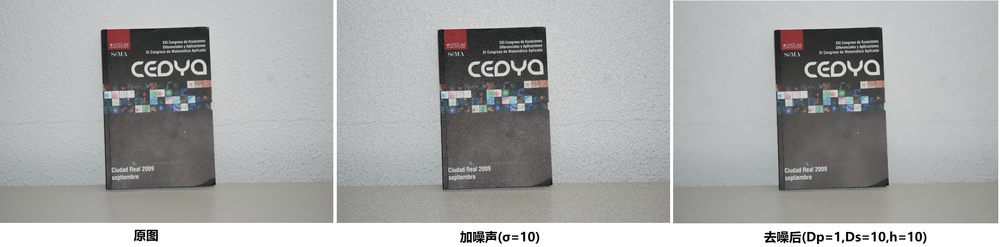
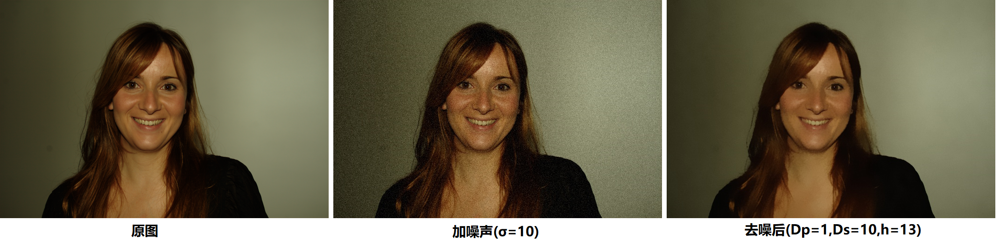
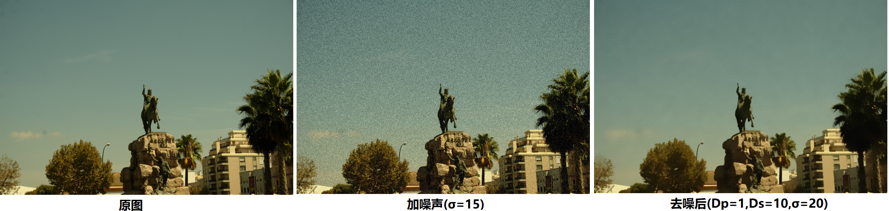

# 主要算法

这次实验的主要内容是实现一下Non-Local Means去噪算法。

* patch的大小是$D_p \times D_p$，搜索框的大小是$D_s \times D_s$，设一张图片总像素个数是$N$，那么原生论文的算法复杂度是$O(N\times D_p^2 \times D_s^2)$。
* 可以先枚举搜索框里对应的偏移方向$(p,q)$，然后对于每个位置$(x,y)$，求出$(x,y)$和$(x+p,y+q)$的距离，那么对于一个patch的距离，就相当于求一个二维数组的某个矩形的和，可以用积分图优化。优化后的时间复杂度$O(N \times D_s^2)$。
* 注意$exp(x)$如果用库函数实现会很慢（库函数是泰勒展开实现的）。可以自己打表实现，每隔$\frac{1}{1000}$，计算一下$exp(x)$的值，然后对于要求的$exp(x)$，找到离其最近的两个已求出的点，将中间当作直线进行近似。
* 大概$512 \times 512$的图片在本机上跑了$3s$。

# 实验结果

